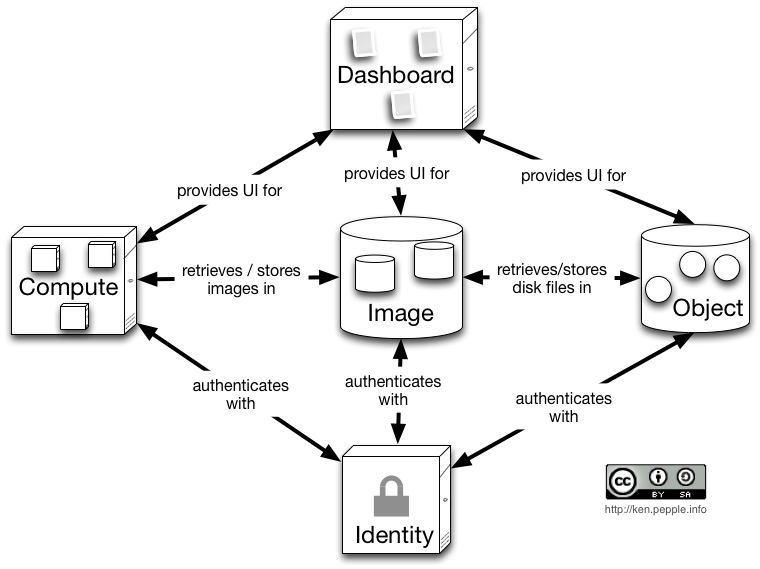

############
Architecture
############

This section will provide you with an overview of the currently supported deployment scenarios for OpenStack. You should already be familiar with the components for the OpenStack 'Essex' release:

|essex|

source: http://ken.pepple.info/openstack/2012/02/21/revisit-openstack-architecture-diablo/

Current Essex Configurations
----------------------------
The currently supported 'Essex' configurations are:
 - :doc:`Compute All-in-One </architecture/allinone>`: A full OpenStack Compute deployment on a single host.
 - :doc:`Compute Single Controller + N Compute </architecture/1+n>`: A single Controller with 1 or more Nova Compute nodes.

.. note::
  **Chef for OpenStack** has not added Swift yet, but it will be added soon from the Rackspace `rcbops-cookbooks/swift repository <https://github.com/rcbops-cookbooks/swift>`_.

Please refer to the :doc:`Example Deployment </example>` for a detailed reference implementation.

OpenStack is very flexible, so additional configurations will continue to be supported in the future.

.. toctree::

   architecture/allinone
   architecture/1+n

